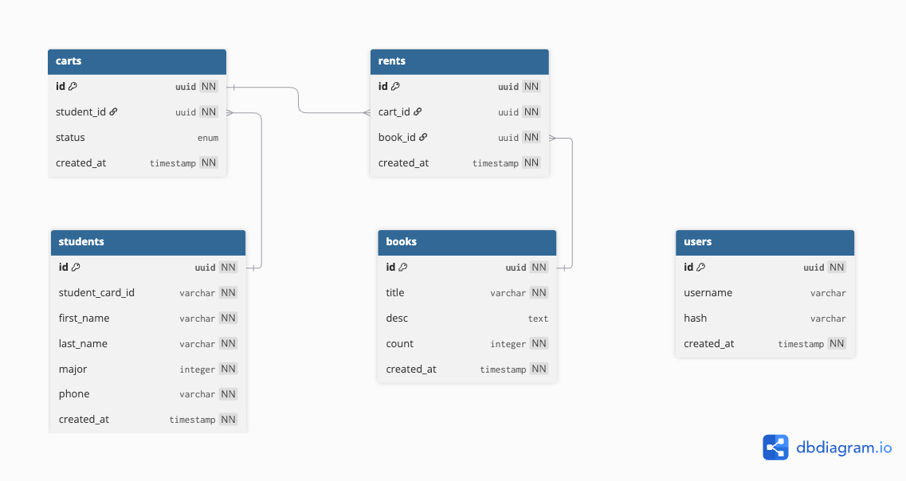

# Book Rental System
#### Video Demo:  <URL HERE>
#### Description:
A book rental system designed for a university library to streamline and digitize the book lending process.
#### Technology: 
Built with React.js + MUI + Vite

---
### Project Details
#### Tech Stack

This is a full-stack web application with:
- Frontend: JavaScript (React.js)
- Backend: Golang

#### Team

This project was a collaborative effort by two team members:
- Danny [https://github.com/dannykhant]
- Dther [https://github.com/dtherhtun]

#### Team Duties

- Danny - Frontend Development
- Dther - Backend Development

---
### Product Requirements Document
#### Background

The university required a library system to manage book rentals efficiently. Manual management with pen and paper was tedious, error-prone, and not scalable.

#### User Stories

* As a librarian, I want to register books so I can manage inventory.

* As a librarian, I want to record who rents books to keep track of lending.

* As a librarian, I want to search for books and check stock for quick access.

* As a librarian, I want to view rental history to track all borrowing activities.

* As a librarian, I want to generate overdue reports to follow up with students.

* As a librarian, I want to register students to track who is borrowing.

* As a librarian, I want to receive returned books to update their availability.

#### Key Requirements

- **User Authentication:**
  - Secure login and logout functionality.

- **Book Management:**
  - Register books with:
    - Title
    - Description
    - Author
    - Quantity
  - View and search all registered books.
  - Add books to a cart and complete lending transactions.
    - Search by book title.
    - Link rental to a student via student card ID.
    - Checkout transaction with up to 3 books per lending.

- **Return Management:**
  - Search transactions by student card ID.
  - Mark returned books as received.

- **Student Registration:**
  - Register student with:
    - Student card ID (e.g., HVD024)
    - First Name & Last Name
    - Major
    - Phone Number

- **Reporting:**
  - All rented books (table report)
  - Top 10 most borrowed books
  - Top 10 overdue books (table report)

#### Wireframe


#### ER Diagram


---
### Prerequisites

Make sure you have the following installed:
- [Docker](https://www.docker.com/products/docker-desktop)
- [Node.js](https://nodejs.org/) (for frontend development only)

---
### How to Test
#### App Deployment with Docker
* Create a file named `docker-compose.yml` and paste the following:

```yml
version: '3'
services:
  backend:
    image: ghcr.io/cs50bookrentalsystem/brsbackend:latest
    container_name: backend
    ports:
      - "8080:8080"

  frontend:
    image: ghcr.io/cs50bookrentalsystem/brsfrontend:latest
    container_name: frontend
    ports:
      - "5173:5173"
    environment:
      - VITE_API=http://backend:8080
    depends_on:
      - backend
```

* Run the following command to start the application:

```
docker compose up -d
```

* To stop and clean up containers:

```
docker compose down
```

* Open your browser and go to http://localhost:5173 to view the app.

---
#### Frontend Development

* Install dependencies:

```
npm install
```

* Start the development server:

```
npm run dev
```

---
### Acknowledgements

- Inspired by university library systems and digital transformation projects.
- Thanks to CS50 and open-source communities for learning materials and tools.

---